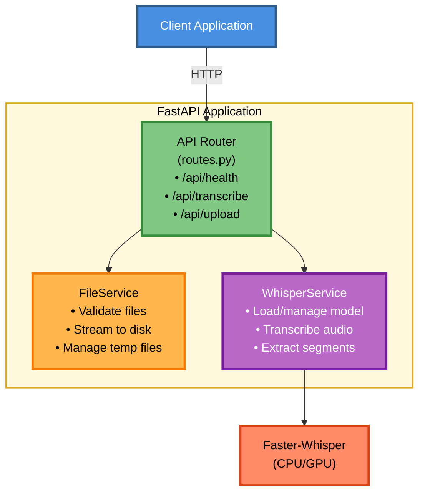
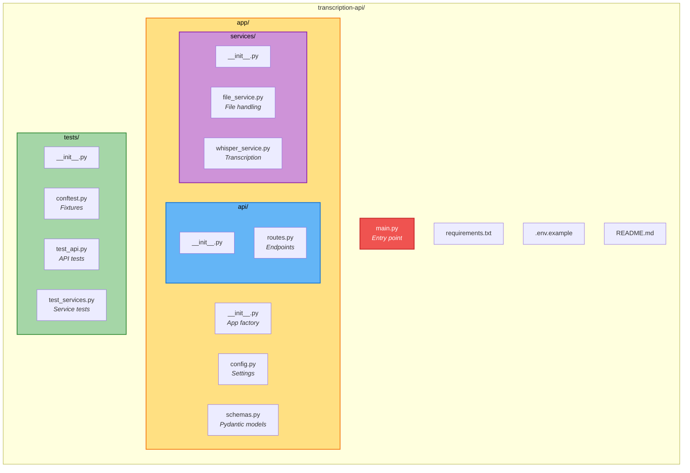
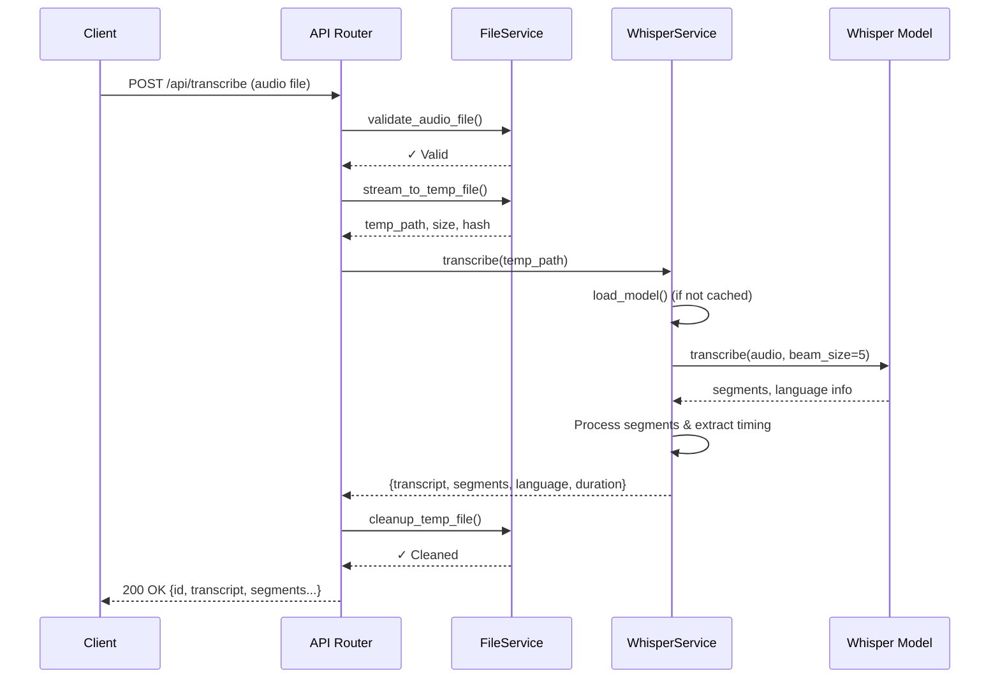
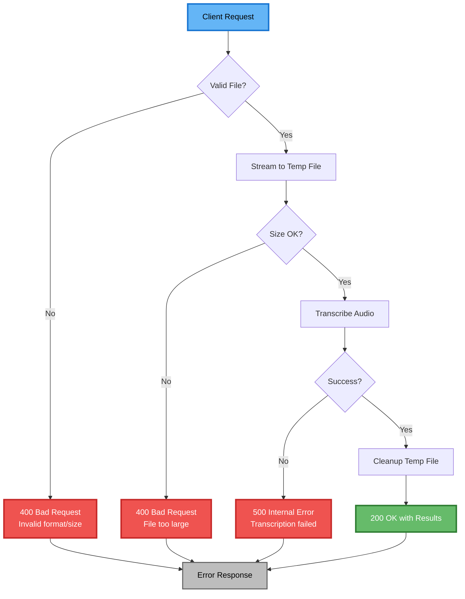
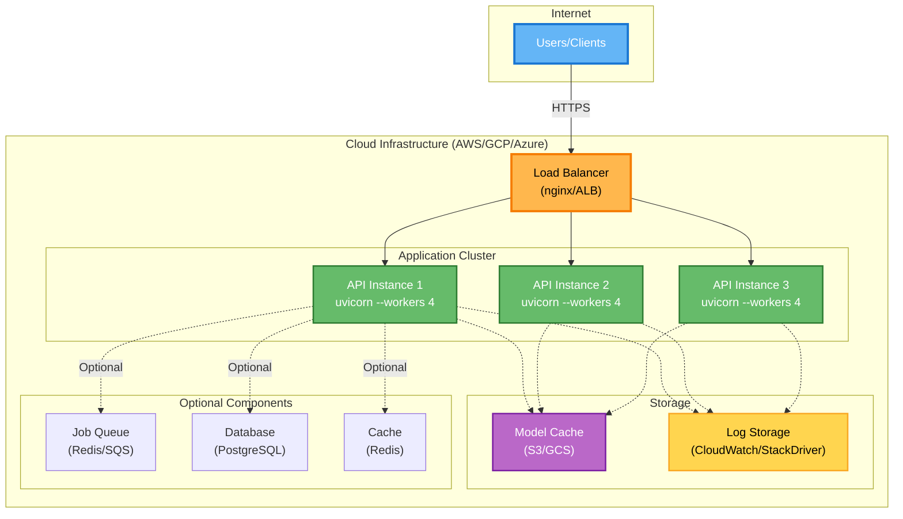

# Transcription API

A production-grade FastAPI service for converting audio files to text using OpenAI's Whisper model via the faster-whisper library.

## Overview

This API provides:
- **Audio Transcription**: Convert audio files (WAV, MP3, FLAC, OGG, WebM, MP4, M4A) to text with timestamped segments
- **File Upload**: Upload and validate audio files independently
- **Health Checks**: Monitor service availability
- **Configurable Models**: Support for different Whisper model sizes (tiny, base, small, medium, large)
- **Error Handling**: Comprehensive validation and error reporting

## Architecture

> **📁 Implementation Files:**
> - [`app/__init__.py`](app/__init__.py) - FastAPI app factory and CORS setup
> - [`app/api/routes.py`](app/api/routes.py) - API endpoints and routing
> - [`app/services/file_service.py`](app/services/file_service.py) - File validation and management
> - [`app/services/whisper_service.py`](app/services/whisper_service.py) - Whisper model and transcription logic
> - [`main.py`](main.py) - Application entry point with logging and middleware



## Project Structure



**File Tree:**
```
transcription-api/
├── app/
│   ├── __init__.py           # App factory, lifespan management
│   ├── config.py             # Settings with pydantic-settings
│   ├── schemas.py            # Pydantic models for requests/responses
│   ├── api/
│   │   ├── __init__.py
│   │   └── routes.py         # API endpoint definitions
│   └── services/
│       ├── __init__.py
│       ├── file_service.py   # File handling and validation
│       └── whisper_service.py # Model management and transcription
├── tests/
│   ├── __init__.py
│   ├── conftest.py           # Pytest fixtures
│   ├── test_api.py           # API endpoint tests
│   └── test_services.py      # Service layer tests
├── main.py                   # Application entry point
├── requirements.txt          # Python dependencies
├── .env.example             # Environment configuration template
└── README.md                # This file
```

## Setup

### Prerequisites

- Python 3.9+
- Virtual environment tool (venv, virtualenv, or poetry)

### Installation

1. **Clone/navigate to project directory:**

```bash
cd /Users/shozibsayyed/Projects/volgatest
```

2. **Create and activate virtual environment:**

```bash
# Create venv (already done, but for reference)
python3 -m venv venv

# Activate (macOS/Linux)
source venv/bin/activate

# Activate (Windows)
venv\Scripts\activate
```

3. **Install dependencies:**

```bash
pip install -r requirements.txt
```

4. **Configure environment (optional):**

```bash
# Copy example configuration
cp .env.example .env

# Edit .env with your settings if needed
nano .env
```

## Running the Application

### Development Mode

```bash
# From project root with venv activated
python main.py
```

The API will start at `http://localhost:8000`

**Interactive API documentation:** `http://localhost:8000/docs`

### Production Mode

```bash
uvicorn main:app --host 0.0.0.0 --port 8000 --workers 4
```

### With Custom Configuration

```bash
# Override model size
MODEL_SIZE=small python main.py

# Use GPU with float16 precision
DEVICE=cuda COMPUTE_TYPE=float16 python main.py
```

## API Endpoints

> **📁 Implementation:** [`app/api/routes.py`](app/api/routes.py)
>
> All endpoints are defined in the routes file with full error handling and validation.

### 1. Health Check

**Endpoint:** `GET /api/health`

**Description:** Check service health and API version

> **💻 Implementation:** See `health_check()` function in [`app/api/routes.py`](app/api/routes.py)

**Response:**
```json
{
  "status": "healthy",
  "version": "1.0.0"
}
```

**Example:**
```bash
curl -X GET http://localhost:8000/api/health
```

---

### 2. Transcribe Audio

**Endpoint:** `POST /api/transcribe`

**Description:** Upload audio file and get transcription with timestamped segments

> **💻 Implementation:** See `transcribe_audio()` function in [`app/api/routes.py`](app/api/routes.py)
>
> **🔧 Uses:**
> - `FileService.validate_audio_file()` from [`app/services/file_service.py`](app/services/file_service.py)
> - `FileService.stream_to_temp_file()` from [`app/services/file_service.py`](app/services/file_service.py)
> - `WhisperService.transcribe()` from [`app/services/whisper_service.py`](app/services/whisper_service.py)

**Request:**
- Method: POST
- Content-Type: multipart/form-data
- Parameter: `file` (binary) - Audio file

**Supported Formats:**
- `.wav`, `.mp3`, `.flac`, `.ogg`, `.webm`, `.mp4`, `.m4a`

**Response:**
```json
{
  "id": "123e4567-e89b-12d3-a456-426614174000",
  "language": "en",
  "duration_seconds": 45.10,
  "transcript": "In a quiet corridor of a Sydney hospital...",
  "segments": [
    {
      "start": 0.0,
      "end": 3.42,
      "text": "In a quiet corridor"
    },
    {
      "start": 3.42,
      "end": 6.81,
      "text": "of a Sydney hospital"
    }
  ]
}
```

**Example:**
```bash
# Using curl
curl -X POST http://localhost:8000/api/transcribe \
  -F "file=@/path/to/audio.wav"

# Using Python requests
import requests

with open("audio.wav", "rb") as f:
    response = requests.post(
        "http://localhost:8000/api/transcribe",
        files={"file": f}
    )
    print(response.json())
```

**Error Responses:**
- `400 Bad Request`: Invalid file format, file too large, or missing file
- `500 Internal Server Error`: Transcription processing failed

---

### 3. Upload Audio File

**Endpoint:** `POST /api/upload`

**Description:** Upload and validate audio file without transcribing (useful for batch processing)

> **💻 Implementation:** See `upload_audio_file()` function in [`app/api/routes.py`](app/api/routes.py)
>
> **🔧 Uses:**
> - `FileService.validate_audio_file()` from [`app/services/file_service.py`](app/services/file_service.py)
> - `FileService.stream_to_temp_file()` from [`app/services/file_service.py`](app/services/file_service.py)

**Request:**
- Method: POST
- Content-Type: multipart/form-data
- Parameter: `file` (binary) - Audio file

**Response:**
```json
{
  "id": "123e4567-e89b-12d3-a456-426614174000",
  "original_filename": "meeting.wav",
  "content_type": "audio/wav",
  "extension": ".wav",
  "size_bytes": 2187644,
  "sha256": "abc123def456...",
  "temp_file_path": "/tmp/tmp1a2b3c4d.wav"
}
```

**Example:**
```bash
curl -X POST http://localhost:8000/api/upload \
  -F "file=@meeting.wav"
```

---

## Request Flow

> **📁 Files involved in a typical transcription request:**
> 1. [`app/api/routes.py`](app/api/routes.py) - Receives HTTP request at `transcribe_audio()` endpoint
> 2. [`app/services/file_service.py`](app/services/file_service.py) - Validates and streams file
> 3. [`app/services/whisper_service.py`](app/services/whisper_service.py) - Loads model and transcribes
> 4. [`app/schemas.py`](app/schemas.py) - Validates and structures the response

The following diagram shows how a transcription request flows through the system:



### Error Handling Flow



## Testing

> **📁 Test Files:**
> - [`tests/test_api.py`](tests/test_api.py) - API endpoint tests (11 tests)
> - [`tests/test_services.py`](tests/test_services.py) - Service layer tests (12 tests)
> - [`tests/conftest.py`](tests/conftest.py) - Pytest fixtures and test configuration
>
> **Coverage:** 23 tests covering all critical paths including error handling

### Run All Tests

```bash
# With venv activated
pytest
```

### Run Specific Test File

```bash
pytest tests/test_api.py
pytest tests/test_services.py
```

### Run Tests with Coverage

```bash
pip install pytest-cov
pytest --cov=app --cov-report=html
```

### Run Tests Verbosely

```bash
pytest -v
pytest -v -s  # Also show print statements
```

### Test Categories

**API Tests** (`tests/test_api.py`):
- Health check endpoint
- File upload validation
- Transcription endpoint
- Real audio file transcription (skipped if file not available)

**Service Tests** (`tests/test_services.py`):
- File validation and streaming
- Temporary file management
- Model loading and caching
- Transcription with real audio (skipped if file not available)

### Running Tests with Real Audio

The test suite includes optional tests that use the real audio file (`scene_001.wav`) if available:

```bash
pytest tests/test_api.py::TestRealAudio -v
pytest tests/test_services.py::TestWhisperService::test_transcribe_real_audio -v
```

These tests are automatically skipped if the audio file isn't found.

## Configuration

> **📁 Configuration Files:**
> - [`app/config.py`](app/config.py) - Settings class with Pydantic validation
> - [`.env.example`](.env.example) - Environment variable template
> - `.env` - Your local configuration (create from `.env.example`)

Configuration is managed through the [`app/config.py`](app/config.py) file using Pydantic Settings. Values are read from:

1. Environment variables (highest priority)
2. `.env` file
3. Hardcoded defaults (lowest priority)

### Available Settings

| Setting | Default | Description |
|---------|---------|-------------|
| `API_TITLE` | Transcription API | API title for OpenAPI docs |
| `API_VERSION` | 1.0.0 | API version |
| `LOG_LEVEL` | INFO | Logging level (DEBUG, INFO, WARNING, ERROR) |
| `MODEL_SIZE` | base | Whisper model size (tiny, base, small, medium, large) |
| `DEVICE` | cpu | Computing device (cpu, cuda) |
| `COMPUTE_TYPE` | int8 | Computation precision (int8, float16, float32) |
| `MAX_FILE_SIZE` | 104857600 | Maximum file size in bytes (100 MB) |

### Example .env File

```bash
# .env
LOG_LEVEL=DEBUG
MODEL_SIZE=base
DEVICE=cpu
COMPUTE_TYPE=int8
MAX_FILE_SIZE=209715200  # 200 MB
```

## Development

> **📁 Key Development Files:**
> - [`app/schemas.py`](app/schemas.py) - Pydantic models for all requests and responses
> - [`app/api/routes.py`](app/api/routes.py) - FastAPI router with all endpoints
> - [`app/services/`](app/services/) - Business logic layer (services)
> - [`tests/`](tests/) - Test suite with fixtures

### Adding New Endpoints

1. Define request/response schemas in [`app/schemas.py`](app/schemas.py)
2. Implement endpoint logic in [`app/api/routes.py`](app/api/routes.py)
3. Add tests in [`tests/test_api.py`](tests/test_api.py)

### Adding New Services

1. Create service class in [`app/services/`](app/services/)
2. Implement business logic with proper error handling
3. Add tests in [`tests/test_services.py`](tests/test_services.py)

### Code Standards

- Type hints on all functions
- Docstrings for functions and classes
- Comprehensive error handling
- 100% test coverage for critical paths

## Deployment

> **📁 Deployment Files:**
> - [`main.py`](main.py) - Application entry point with production logging
> - [`requirements.txt`](requirements.txt) - Python dependencies
> - [`.env.example`](.env.example) - Environment configuration template
>
> **🚀 Entry Command:** `uvicorn main:app --host 0.0.0.0 --port 8000 --workers 4`

### Deployment Architecture



### Docker Deployment

```dockerfile
FROM python:3.11-slim

WORKDIR /app

COPY requirements.txt .
RUN pip install -r requirements.txt

COPY . .

CMD ["uvicorn", "main:app", "--host", "0.0.0.0", "--port", "8000"]
```

### Environment Variables for Production

```bash
LOG_LEVEL=WARNING
DEVICE=cuda  # If GPU available
COMPUTE_TYPE=float16  # Faster on GPU
MODEL_SIZE=small  # Smaller model for production
```

## Performance Considerations

> **📁 Performance-Critical Files:**
> - [`app/services/whisper_service.py`](app/services/whisper_service.py) - Singleton pattern for model caching (see `load_model()`)
> - [`app/services/file_service.py`](app/services/file_service.py) - Streaming file uploads (see `stream_to_temp_file()`)
> - [`app/config.py`](app/config.py) - Model size and compute type configuration

### Model Selection

- **tiny**: Fastest, least accurate (39 MB)
- **base**: Balanced (141 MB) - DEFAULT (configured in [`app/config.py`](app/config.py))
- **small**: Slower, more accurate (461 MB)
- **medium**: Much slower, very accurate (1.5 GB)
- **large**: Slowest, highest accuracy (2.9 GB)

### Optimization Tips

1. **Use GPU if available**: Set `DEVICE=cuda` for 5-10x speedup
2. **Use appropriate model**: Start with `base`, upgrade if needed
3. **Use float16 on GPU**: Set `COMPUTE_TYPE=float16` for memory savings
4. **Batch processing**: Use `/api/upload` + separate transcription jobs
5. **Caching**: Model is loaded once and reused across requests

## Troubleshooting

### Model Download Issues

```bash
# Set HF token for faster downloads
export HF_TOKEN=your_token

# Or download model manually
python -c "from faster_whisper import WhisperModel; WhisperModel('base')"
```

### Memory Issues

- Reduce `MODEL_SIZE` to `tiny` or `base`
- Set `COMPUTE_TYPE=int8` instead of `float16`
- Run on CPU instead of GPU initially

### CUDA/GPU Not Detected

```bash
# Verify CUDA installation
python -c "import torch; print(torch.cuda.is_available())"

# Check faster-whisper
python -c "from faster_whisper import WhisperModel; m = WhisperModel('base', device='cuda')"
```

## License

This project is provided as-is for educational and commercial use.

## Support

For issues or questions:
1. Check the troubleshooting section above
2. Review test cases for usage examples
3. Check API documentation at `/docs` endpoint
